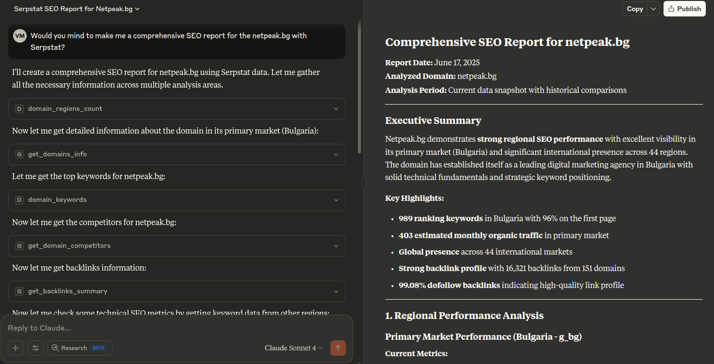
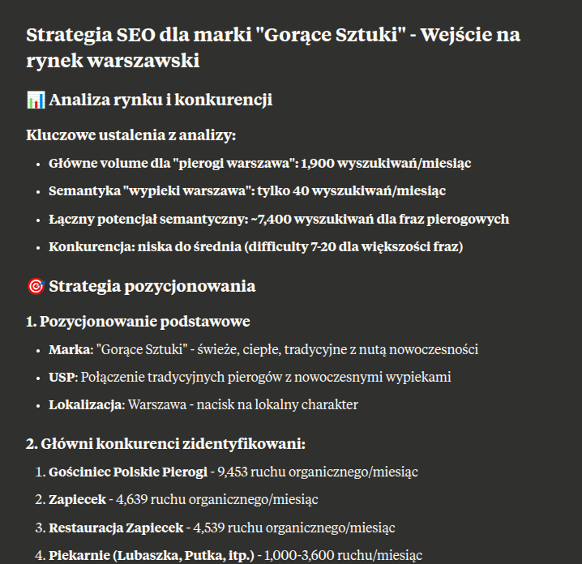

# Serpstat MCP Server

MCP \(Model Context Protocol\) server for integration with Serpstat API, implementing api methods for a SEO analysis.

This is alpha release v0.0.1.

## Requirements

- **Java**: 17+
- **Maven**: 3.6+
- **Serpstat API token**


### To get API token:
- If you didn't have a subscription for the plan: go to https://serpstat.com and buy a subscription or activate trial access for Team or higher plans with API access enabled.
- If you already have a subscription: go to [Your Serpstat Profile](https://serpstat.com/users/profile/) and copy it.


## Installation and debug

1. **Install JRE 17+ if needed**
   ```bash
   sudo apt-get install openjdk-17-jre
2. **Install Maven if needed**
   ```bash
   sudo apt-get install maven
    ```
3. **Clone or create the project:**
   ```bash
   mkdir serpstat-mcp-server
   cd serpstat-mcp-server
   ```
4. **Build mcp server jar**
   ```bash
   mvn clean package
   ```
5. **Maka run script for test tool**
   ```bash
    cp inspect.sh.example inspect.sh
    chmod +x inspect.sh
    # edit file and set token
    vi inspect.sh
    ./inspect.sh
    ```
   
6. **Check console and open given url in browser**

   ```bash 
   user@pc:~/repo/serpstat-mcp-server-java$ ./inspect.sh
   Starting MCP inspector...
   ⚙️ Proxy server listening on port 6277
   🔍 MCP Inspector is up and running at http://127.0.0.1:6274 🚀
   ```
   
## Integration into Claude Desktop
- Open in Claude Desktop  `Settings → General → Claude Settings -> Configure`
- Add configuration with your path to jar file and token. Save it.
```json
{
   "mcpServers": {
      "serpstat": {
         "command": "java",
         "args": ["-jar", "/path/to/jar/location/serpstat-mcp-server-java-0.0.1.jar"],
         "env": {
            "SERPSTAT_API_TOKEN": "PLACE_API_TOKEN_HERE"
         }
      }
   }
}
```

## Make The First Report!
 Try prompt ```Would you mind to make me a comprehensive SEO report for the netpeak.ua with Serpstat?```



[#1 Example SEO Report Artifact for domain netpeak.ua](https://claude.ai/public/artifacts/13f52424-7470-4374-984f-64beebc8306a)

You can try prompts in your language!
   ```
   Hej słodziaki SEO! 🥺👉👈 
   Potrzebuję MEGA EPICKIEGO raportu SEO dla ringostat.com, ale żeby był tak CRINGE jak tylko możliwe z Serpstat API! 😭💀
   Zrób to po polsku ale z takimi anglicizmami żeby moja babcia myślała że jestem INFLUENCER! 😎📱
   ```


[#2 Example SEO Report Artifact for domain ringostat.com](https://claude.ai/public/artifacts/b3823232-4744-412e-beb3-8b80b40f63f7)

## Included Tools (v.0.0.1) 

### `get_domains_info`
Get comprehensive domain information using Serpstat API. Returns visibility, keywords count, estimated traffic, dynamics and PPC data for multiple domains.

### `domain_regions_count`
Analyze domain keyword presence across all Google regional databases. Shows keyword count by country, regional performance comparison and international SEO insights. Start every complex domain analysis with this tool.

### `domain_keywords`
Get keywords that domain ranks for in Google search results. Includes position, traffic, difficulty analysis with comprehensive SEO insights and performance metrics.

### `get_domain_competitors`
Get top 20 domain competitors from search results with SEO metrics, traffic, visibility, and relevance score.

### `get_backlinks_summary`
Get a comprehensive backlinks summary using Serpstat API. Returns referring domains, backlinks count, link types, quality metrics and recent changes for domain or subdomain.

### `api_stats`
Get current API usage statistics and credit limits. Shows remaining credits, usage percentage, and provides recommendations for optimal usage.

### `projects_list`
Get a list of user projects with details like project ID, name, domain, creation date and user role. Useful for project management and getting project IDs for other API calls. Does not consume API credits.",


## Logging

Logs are written to:
- **File** `logs/serpstat-mcp-server.log` \(all levels\)

Log files are automatically rotated by day and size.

## Error Handling

The server handles the following types of errors:
- Missing or invalid API token.
- Invalid request parameters.
- Network and HTTP errors.
- Serpstat API errors.
- Internal server errors.


## Integration

**Set the environment variable with the API token:**

Run the following command in the terminal \(replace `your_serpstat_api_token_here` with your token\):

```bash
export SERPSTAT_API_TOKEN=your_serpstat_api_token_here
```

## Security

- The API token is passed via an environment variable.
- The token is not fully logged.
- All HTTP requests use HTTPS.
- Timeouts are configured to prevent hanging.


## Support
The most effective way to receive support from Serpstat is to use their live chat feature directly within the platform. 

Alternatively, you can email them at [support@serpstat.com](mailto:support@serpstat.com)

## License

MIT License

- This thing is under MIT license, which means you can copy, use, modify and even sell any part of this code without any hassle. 
- Want to grab a chunk for your project? Go for it. 
- Want to rewrite half of it and ship a commercial product? Be my guest. 
- The only thing you need to do is not delete the copyright and the license itself from the files you take, and remember the Serpstat team with a kind word when you get that paycheck.


_With love, Serpstat R&D Team_ 

```